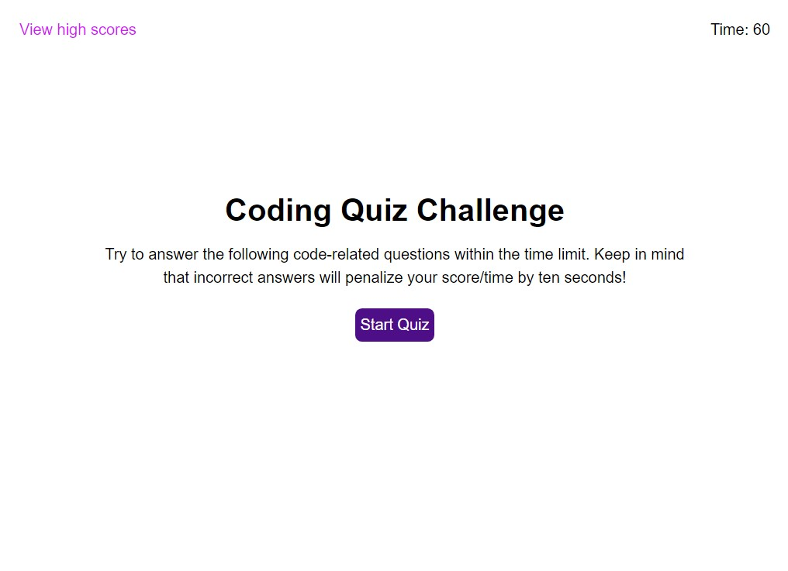

# Code Quiz

## Description
A timed coding quiz browser application with multiple-choice questions. There is a time penalty for missed questions. At the end of the quiz, users can submit their initials to save their scores.

## Installation
You can clone this repository on GitHub at https://github.com/averyjmiller/code-quiz

## Usage
Users may use this browser application to test their HTML/CSS/JavaScript knowledge in a fun and challenging way. Visit the deployed application here: https://averyjmiller.github.io/code-quiz/. 

## Credits
* The method for the 'clearHighScores' function is provided by https://www.w3schools.com/jsref/met_node_removechild.asp
* The removeAttribute method in the renderSaveScoreElement() function is provided by https://stackoverflow.com/questions/1870441/remove-all-attributes

## License
Please refer to the LICENSE in the repo.